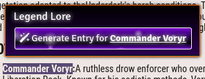

# Ollama Lore Foundry

An LLM-powered journal content generator for FoundryVTT using Ollama as the backend. This module allows game masters to quickly generate lore, item descriptions, character backgrounds, and other narrative content directly within FoundryVTT journals.

## Features

- Generate narrative content using local LLM models via Ollama
- Customizable templates for different content types
- D&D 5e integration for items, NPCs, and locations
- Highlight text to generate content based on selected context
- Built-in templates for common RPG elements
- No data sent to external services - everything runs locally

## Requirements

- FoundryVTT v11.0 or higher
- [Ollama](https://ollama.ai/) installed and running on your local machine or network
- A compatible LLM model loaded in Ollama (llama2, mistral, etc.)

## Installation

### Method 1: FoundryVTT Module Browser

1. Open the Module Browser in your FoundryVTT setup
2. Search for "Ollama Lore"
3. Click Install

### Method 2: Manual Installation

1. Download the [latest release](https://github.com/ArcadiaFrame/ollama-lore-foundry/archive/refs/heads/main.zip)
2. Extract the zip file to your FoundryVTT modules directory
3. Restart FoundryVTT and enable the module in your world

### Method 3: Manifest URL

1. In FoundryVTT, navigate to the Add-on Modules tab
2. Click "Install Module"
3. Paste the following manifest URL: `https://raw.githubusercontent.com/ArcadiaFrame/ollama-lore-foundry/main/module.json`
4. Click "Install"

## Configuration

1. Install and start Ollama on your local machine or network
2. Pull a compatible model using Ollama (e.g., `ollama pull mistral`)
3. In FoundryVTT, navigate to Game Settings > Configure Settings > Module Settings
4. Find the "Ollama Lore" section and configure:
   - **Text Generation API URL**: Default is `localhost:11434` (change if Ollama is running on a different machine)
   - **Enable HTTPS**: Disable for local connections (default: disabled)
   - **API Key**: Only required if your Ollama instance uses authentication
   - **Default Model**: Select your preferred model from the available models in Ollama
5. Click "Verify Connection" to test your setup

## Usage

### Generating Content

1. Open a journal entry in FoundryVTT
2. Click the "Ollama Lore" button in the journal editor toolbar
3. Select a template from the available options
4. Fill in any required fields in the dialog
5. Click "Generate" to create content

### Using Templates

The module comes with several built-in templates:
- **D&D 5e Items**: Generate detailed item descriptions with properties and lore
- **Character Backgrounds**: Create NPC backstories and personalities
- **Location Descriptions**: Generate atmospheric location descriptions

### Highlighting Text

1. Highlight text in a journal entry
2. Right-click and select "Generate with Ollama Lore"
3. Choose a template that will incorporate your highlighted text

## Troubleshooting

- **Connection Issues**: Ensure Ollama is running and accessible at the configured URL
- **Model Not Found**: Verify you've pulled the model using Ollama CLI (`ollama pull modelname`)
- **Slow Generation**: Larger models require more resources; consider using a smaller model

## Development

This module is open source and contributions are welcome. The repository is hosted at [GitHub](https://github.com/ArcadiaFrame/ollama-lore-foundry).

### Building from Source

1. Clone the repository
2. Install dependencies with `npm install`
3. Make your changes
4. Build with `npm run build`

## License

[MIT License](LICENSE)
